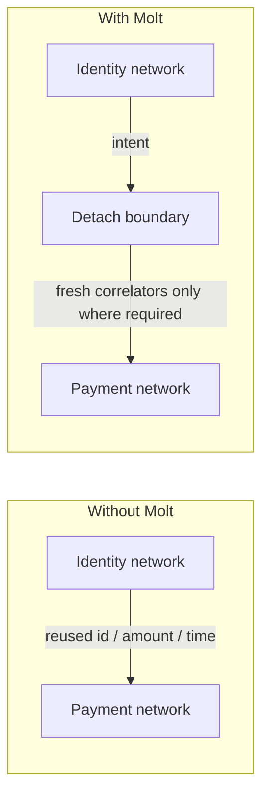

# pubky-molt

**Molt** is a privacy routing layer: it carries *intent* across identity, transport, and payment networks while shedding the continuity that lets an observer join one network’s view to another. The name is literal — at each network boundary it molts the identifiers it no longer needs, the way an animal sheds a skin.

This crate is the protocol-neutral routing core (witnesses, manifests, segments, detach levels, bounded planner, continuity-cost scorer). It contains no cryptography and depends on no other Pubky crate.

## The problem in one picture

Privacy tools today are usually per-network: Tor for IP, CoinJoin for coins, a fresh account for identity. The leak is at the *joins* between networks — the same identifier, timing, or amount reused across two observation domains.

```text
WITHOUT MOLT                         WITH MOLT
────────────                         ─────────

  identity net                         identity net
       │                                    │
       │  same pubky / same timing          │  intent only
       ▼                                    ▼
  ─ ─ ─ ─ ─ ─ ─ ─ ─ ─ ─ ─ ─ ─         ─ ─ detach boundary ─ ─
  observer joins both views            (no join-capable value
       │                                crosses unless a Segment
       ▼                                says it must)
  payment net                          payment net
```



**Criterion.** If an observer who sees network A and network B can match the same value across both, the boundary failed. Molt’s job is to make that match require either a protocol-declared `Segment` or collusion the `Assumptions` explicitly allow.

## Core idea

**Thesis.** Minimize observable continuity, subject to the continuity the higher-level protocol actually requires.

**Principle.** Carry intent across boundaries. Do not carry identity unless the next hop requires it.

**Operationally.**

1. Each hop is an [`Adapter`](src/route.rs) with a declared [`Manifest`](src/witness.rs): which [`Witness`](src/witness.rs)es learn which [`Field`](src/witness.rs)s, and which [`CorrelatorSpec`](src/witness.rs)s cross untransformed (`preserves`).
2. Protocol-required continuity is an open [`Segment`](src/witness.rs) (e.g. a Lightning payment hash for the life of the HTLC path). Inside a segment, correlators are checked as preserved and are **not** scored as leaks. Past the close, they must stop.
3. At each boundary, [`detach_level`](src/witness.rs) asks whether any join-capable correlator still crosses, and whether any [`ObservationDomain`](src/witness.rs) is known to see both sides.
4. [`score`](src/score.rs) turns predicted joins (per domain set, with [`Confidence`](src/score.rs)) into a continuity cost, minus detach bonuses, under caller [`Weights`](src/score.rs) and a [`CostPolicy`](src/score.rs).

**Failure mode.** Treating “field count” or “number of hops” as privacy. A single preserved `TRANSACTION_ID` across two domains is a stronger join than ten unrelated `CONTENT_SIZE` observations.

**Governing rule.** Publicly rooted state is globally linkable. Pairwise state stays private unless a participant deliberately promotes evidence. Bond-derived secrets, channel ids, and transport ids are never promotable (those live in sibling crates; this crate only models their observation surface).

**Criterion.** A route is better when, under the same `Assumptions`, its continuity cost is lower — not when it has more hops.

## Vocabulary

| Term | Meaning | Where |
|------|---------|--------|
| `RouteState` | Typed position of an interaction (identity / transport / value / custom) plus who [`Holder`](src/route.rs) controls it | `src/route.rs` |
| `Adapter` | Hop: `RouteState → RouteState` with manifest, quote, recovery, segment effects, optional constraints | `src/route.rs` |
| `Segment` | Span where named correlator *kinds* must stay continuous; open ⇒ checked, not scored; past close ⇒ leak if they cross | `src/witness.rs` |
| `Manifest` / `Witness` | Declared observation surface of a hop: who learns which `Field`s in/out, what `preserves` | `src/witness.rs` |
| `ObservationDomain` | Real-world entity an operator belongs to (company, chain-observer class, …). Joins are computed from domains, not roles | `src/witness.rs` |
| `DomainRegistry` | Advisory bag of `DomainClaim`s with provenance. Absence ⇒ independence `Unknown`, never “proven” | `src/witness.rs` |
| `CorrelatorSpec` | Kind of matchable identifier (`Field` + namespace, e.g. `lightning.payment_hash`) | `src/witness.rs` |
| `Correlator` | Concrete value of that kind, carried only as a BLAKE3 fingerprint (`pubky-molt/fp/v1` ‖ namespace ‖ canonical bytes) | `src/witness.rs` |
| `DetachLevel` | How strongly a boundary breaks linkage: `None` \| `Unknown` \| `Independent` \| `CollusionBounded(k)` | `src/witness.rs` |
| Continuity cost | Joinability score across domains (severity × confidence × set weight − detach bonus), not a field count | `src/score.rs` |
| Bounded planner | BFS under `PlannerLimits` (`max_depth` 4, `max_routes` 8 in v1); extends only from `Holder::Self_` | `src/planner.rs` |

## How scoring works

**What raises continuity cost**

- A domain (or colluding set of size ≤ `Assumptions.colluding_set_size`) observes the same join-capable kind at two observation points.
- The hop `preserves` that `CorrelatorSpec`, so the *same value* crosses by construction → [`Confidence::Exact`](src/score.rs) for identifier kinds, [`High`](src/score.rs) / [`Statistical`](src/score.rs) for amount/time fingerprints inside `time_window_secs`.
- Higher-severity fields cost more (defaults pinned in `tests/vectors/molt_route_v1.json` and `DECISIONS.md`):

  | Kind | Severity |
  |------|----------|
  | `ROOT_IDENTITY` | 100 |
  | `RELATIONSHIP_IDENTITY` | 25 |
  | `PAIRWISE_KEY` | 20 |
  | `NETWORK_IDENTIFIER` / `SESSION_IDENTIFIER` / `TRANSACTION_ID` / `OBLIGATION_ID` | 10 |
  | `AMOUNT` / `TIME` / `DENOMINATION` | 5 |
  | `RELATIONSHIP_LINK` | 2 |
  | other (incl. `CONTENT_SIZE`) | 1 |

**What lowers it**

- Closing a segment before the correlator would cross a domain boundary.
- Declared domain independence (`DetachLevel::Independent` or `CollusionBounded(k)`), which adds a detach bonus: `None=0`, `Unknown=0.1`, `Independent=1.0`, `CollusionBounded(k)=1.0+0.5k`.
- Colluding-set weight `w(|S|)=1/|S|` (larger required collusion ⇒ cheaper attributed join).
- `AMOUNT`/`TIME` joins outside `Assumptions.time_window_secs` are dropped.

**Why field counts are the wrong metric**

`Field` is an observer vocabulary, not a score. A counterparty learning `RELATIONSHIP_IDENTITY | AMOUNT | TIME` can be a bilateral protocol working as designed. A relay learning a `RELATIONSHIP_LINK` that joins two purposes is the continuity Molt is built to remove.

**Worked example (from vectors / unit tests)**

A single hop whose chain witness learns `NETWORK_IDENTIFIER | AMOUNT | TIME` on both sides and whose manifest `preserves` `btc.sats` and `time.unix` scores a **High** confidence amount/time join and `DetachLevel::None` on that hop — the values are continuous by declaration. Opening a `Segment` that `carries` `TRANSACTION_ID` / `lightning.payment_hash` and closing it in the same adapter (Lightning path fixture) excludes that hash from scored leaks for the hop interior; amount and time still cross and still score. Vector case `close_and_open_one_hop` expects `DetachLevel::Independent` when domains are disjoint and no join-capable correlator leaks past the close; `spec_leaking_past_close` expects `None`.

**Criterion.** Prefer the route with lower `RouteScore::continuity_cost` under the same `Assumptions` and `Weights` (e.g. `PRIVATE`: continuity 0.7, cost 0.2, latency 0.1).

## Quick start

```toml
[dependencies]
pubky-molt = { git = "https://github.com/BitcoinErrorLog/pubky-molt" }
```

Minimal shape of the public API (adapters are supplied by clients; this crate ships manifest-only [`DeclaredAdapter`](src/route.rs) fixtures under `fixtures/declared/`):

```rust,ignore
use pubky_molt::planner::{plan, PlannerLimits};
use pubky_molt::route::{
    Adapter, Amount, ConstraintEvaluators, Holder, RouteState,
};
use pubky_molt::score::{score, SingleAsset, PRIVATE};
use pubky_molt::witness::{Assumptions, DomainRegistry};

let from = RouteState::Value {
    network: "lightning".into(),
    amount: Some(Amount {
        asset: "BTC".into(),
        units: "sat".into(),
        value: 50_000,
    }),
    holder: Holder::Self_,
};
let to = RouteState::Value {
    network: "lightning".into(),
    amount: None,
    holder: Holder::Counterparty,
};

// `adapters: &[&dyn Adapter]` — e.g. DeclaredAdapter::from_file(...)
let planned = plan(
    &from,
    &to,
    adapters,
    &ConstraintEvaluators::new(),
    &PlannerLimits {
        max_depth: 4,
        max_routes: 8,
    },
);

for route in &planned.routes {
    let scored = score(
        route,
        adapters,
        &DomainRegistry::new(),
        &Assumptions::default(),
        &PRIVATE,
        &SingleAsset::new("BTC", "sat"),
    )?;
    let preference = scored.total(&PRIVATE);
    println!(
        "hops={:?} continuity={} detaches={:?}",
        route.hops, scored.continuity_cost, scored.detaches
    );
}
```

See `src/score.rs` and `src/planner.rs` unit tests, and `tests/vectors.rs` + `tests/vectors/molt_route_v1.json`, for executable constructions of manifests, segments, and expected detach/score outcomes.

## Where Molt sits

```text
                 application intent
                        │
                        ▼
                   pubky-molt          ← this crate: RouteState, Adapter,
                        │                Segment, Manifest, Witness,
          ┌─────────────┼─────────────┐  detach_level, score, plan
          ▼             ▼             ▼
     paykit-rs        (Tor)         (QUIC) …   clients supply adapters
          │
   Bitcoin · LN · swaps · (Atomicity profile, later)

   pubky-crypto   Bond · Ratchet · Envelope · Intro
   pubky-core     Drop relay (http-relay)
   Pubky / PKARR  root identity and discovery
```

| Crate | Role | Repo |
|-------|------|------|
| [pubky-crypto](https://github.com/BitcoinErrorLog/pubky-crypto) | Pairwise Bond, ratchet, envelope authenticity modes, intro | sibling |
| **pubky-molt** | Routing core (this repo) | [BitcoinErrorLog/pubky-molt](https://github.com/BitcoinErrorLog/pubky-molt) |
| [pubky-core](https://github.com/BitcoinErrorLog/pubky-core) | Drop relay channels on http-relay | sibling |
| [paykit-rs](https://github.com/BitcoinErrorLog/paykit-rs) | First client: bonded payment request / proposal / ACK off the public outbox | sibling |

Atomicity, Tor, swaps, and QUIC/P2P adapters are future clients or adapters. They are not in this crate.

## Honest comparisons

`docs/COMPARISONS.md` is **generated** from `fixtures/baselines/*.json` and `fixtures/declared/*.json` by [`comparisons::render_comparisons`](src/comparisons.rs). Fixtures are honest **declarations** of who learns what under recorded assumptions — not measured anonymity-set guarantees, not lab timings, not resistance to a global passive observer (out of the v1 threat model).

| Baseline | What it breaks | What it still leaks (as declared) | Continuity cost (`PRIVATE` weights)* |
|----------|----------------|-----------------------------------|--------------------------------------|
| CoinJoin (`coinjoin`) | Common-input heuristic within a denominated round | Coordinator + chain see inputs/outputs; amount/time ingress/egress joins remain | Baseline `11.2000` → Molt route `5.5300` |
| PayJoin (`payjoin`) | Common-input heuristic between the two parties | Receiver HTTPS endpoint sees payer network location/time; chain still sees ids/amount/time | `5.6000` → `5.5300` |
| VPN (`vpn`) | Moves ISP view behind one tunnel | One operator learns root-adjacent account, location, every destination, all timing | `3.5000` → `0.9800` |
| Tor onion service (`onion_service`) | Location hiding on a circuit | Stable `.onion` is a stable network id; HsDir/guard timing on live circuits | `9.8000` → `0.9800` |
| Platform market (`platform_market`) | Escrow + discovery among strangers | Platform learns account, every counterparty, amount, denomination, time, content | `17.5000` → `5.5300` |

\*Scores from the committed generated doc under the baselines’ own assumption sets (`colluding_set_size = 1`, …). Molt routes in that doc are illustrative compositions of declared adapters (`molt.intro.session`, `molt.drop.channel`, …), not a claim that every deployment uses that path.

**Criterion.** Read the “Not better when” section of each comparison: Molt removes continuity where counterparties already have a way to find each other; it does not replace chain finality, Tor’s location protection, or a platform’s escrow/discovery.

## Threat model and non-goals

From the frozen architecture and `DECISIONS.md`:

**In scope (v1).** Ordinary application observers; individual infrastructure operators; network-specific graph observers; non-colluding operators across networks; continuity cost under an explicit colluding-set size (default 1).

**Out of scope / non-goals**

- Not a transport and not an anonymity network. It does not move packets, open circuits, or replace Tor/VPN.
- Does not parse application bodies; authenticity modes are carried as declared envelope metadata in sibling crypto, not interpreted here.
- No timing obfuscation, padding, or delay unless an adapter’s manifest declares the corresponding observation surface.
- No protection against a global passive observer with cross-network timing correlation.
- No protection against endpoint compromise, or against counterparties who voluntarily correlate.
- `DomainRegistry` is advisory forever; missing claims never become silent independence.
- Unique amount/timing fingerprints where no adapter transforms them remain joinable within the time window.

**Criterion.** If the threat requires colluding every relay and the chain simultaneously, raise `colluding_set_size` (and expect higher cost or `Unknown` detach) — do not read `Independent` as “safe against the world.”

## Status

- **Version:** 0.1.0 (`Cargo.toml`). Architecture frozen 2026-09-04; the shipped vertical slice is Pubky relationship → Bond → ratcheted Drop → bonded Paykit messages, with this crate scoring and planning the route.
- **Shipped:** Witness/manifest/segment model, `detach_level`, bounded `plan`, continuity `score`, declared fixtures (Lightning path, submarine swap, bounded transfer step), baseline comparison fixtures, deterministic CBOR encodings for correlators/segments/assumptions, vector suite `tests/vectors/molt_route_v1.json`.
- **External audit:** Kimi K3 findings (2026-09-04) addressed in-tree (`DECISIONS.md` “External audit fixes”: PurposeId grammar parity with pubky-crypto, partial-route invariants, correlator matching on kind+namespace, etc.).
- **Deferred (not in this crate):** `Hello` bootstrap UX if still pending in crypto/clients; Atomicity profile (as a Molt *client* in Atomicity repos); Tor / QUIC / P2P / swap *executing* adapters; `DomainRegistry` seed data with provenance; Ring / Bitkit bond UX; upstream pubky-noise handshake-queue relocation.

## Development

```bash
cargo fmt
cargo clippy --all-targets --all-features -- -D warnings
cargo test
cargo doc --no-deps
```

- **Vectors:** add cases to `tests/vectors/molt_route_v1.json` and exercise them from `tests/vectors.rs` (detach / plan / score / trace sections).
- **Declared adapters:** `fixtures/declared/*.json` loaded as `DeclaredAdapter` (manifest-only; never executed).
- **Baselines:** `fixtures/baselines/*.json`; regenerate `docs/COMPARISONS.md` with `MOLT_COMPARISONS_REGENERATE=1 cargo test --doc` when fixture text changes (see `comparisons::render_comparisons` / the crate-level doc test).
- **`DECISIONS.md`:** normative resolutions where the spec was ambiguous (fail-closed custom constraints, unknown latency inside the time window, advisory registry, scoring constants, …). Read it before changing witness or score behavior.

## License

MIT OR Apache-2.0 (see `Cargo.toml`).
